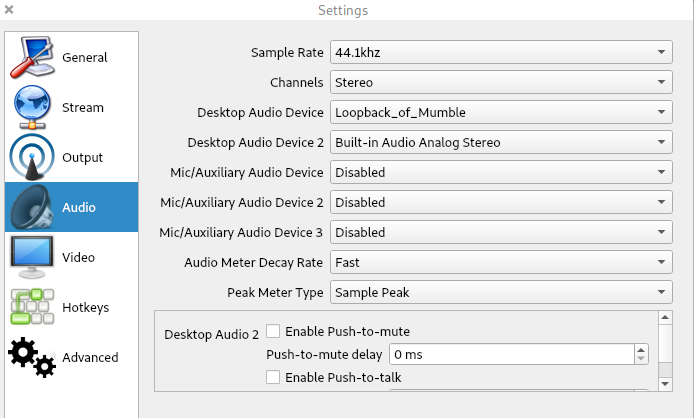

# Voice over Mumble

Use Android/iOS device as your PC's microphone, using Mumble + Plumble. Or use microphone of one PC on other PC.

Linux-only script, but steps can be replicated on other systems (e.g. using VoiceMeeter).

This is the lowest latency I've ever achieved (sounds almost like local loopback, theoretically 7ms WiFi delay + 2x 10ms codec delay = 27 ms).

Alternatives: [WO Mic](https://wolicheng.com/womic/wo_mic_linux.html), [pulseaudio-virtualmic](https://github.com/MatthiasCoppens/pulseaudio-virtualmic).

## Installation

Install Mumble (desktop client) + Murmur (server) + Plumble (Android/iOS client). Set all 3 programs to use best quality and minimal latency. Set mobile client to always streaming.

To install Mumble + Murmur on Ubuntu, you can use:

```bash
sudo apt install mumble mumble-server
sudo systemctl stop mumble-server.service
sudo systemctl disable mumble-server.service
```

For autodiscovery, make sure Avahi is running (it should be on Debian-based systems, but [not necessarily on others](https://github.com/pzmarzly/mic_over_mumble/issues/12)):

```bash
sudo apt install avahi-daemon
sudo systemctl start avahi-daemon.service
```

Copy `mic_over_mumble` anywhere - it will use `~/.mic_over_Mumble` as configuration directory. Don't forget to make it executable (`chmod +x mic_over_mumble`).

Run `mic_over_mumble`. It will start the server on LAN, then start Mumble (if asked for nickname, enter anything other than SuperUser). Then connect your mobile device to the LAN server manually. Please note that Mumble mobile app [has some issues](https://github.com/pzmarzly/mic_over_mumble/issues/4#issuecomment-602817058).

Then, set up your programs to use either "Monitor_of_Mumble" or "VirtualMic" as input device (they are linked). E.g. in OBS:



If for some reason the script messes up your audio config, you can use `pulseaudio -k` to reload PA.
